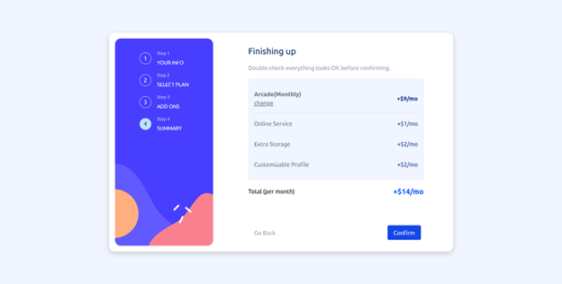

# Frontend Mentor - Multi-step form solution

This is a solution to the [Multi-step form challenge on Frontend Mentor](https://www.frontendmentor.io/challenges/multistep-form-YVAnSdqQBJ). Frontend Mentor challenges help you improve your coding skills by building realistic projects. 

## Table of contents

- [Overview](#overview)
  - [The challenge](#the-challenge)
  - [Screenshot](#screenshot)
  - [Links](#links)
- [My process](#my-process)
  - [Built with](#built-with)
  - [What I learned](#what-i-learned)
  - [Continued development](#continued-development)
  - [Useful resources](#useful-resources)
- [Author](#author)
- [Acknowledgments](#acknowledgments)

## Overview

### The challenge

Users should be able to:

- Complete each step of the sequence
- Go back to a previous step to update their selections
- See a summary of their selections on the final step and confirm their order
- View the optimal layout for the interface depending on their device's screen size
- See hover and focus states for all interactive elements on the page
- Receive form validation messages if:
  - A field has been missed
  - The email address is not formatted correctly
  - A step is submitted, but no selection has been made

### Screenshot

### Links

- Solution URL: [https://github.com/toshirokubota/multi-step-form](https://github.com/toshirokubota/multi-step-form)
- Live Site URL: [https://toshirokubota.github.io/multi-step-form/](https://toshirokubota.github.io/multi-step-form/)

## My process

### Built with

- Semantic HTML5 markup
- CSS custom properties
- Flexbox
- CSS Grid
- Mobile-first workflow
- [React](https://reactjs.org/) - JS library
- TypeScript
- CSCC/SASS
- Tailwind CSS
- Vitest
- Testing-library/react
- Playwright

### What I learned

- I learned how to write end-to-end test scripts using Playwright. I am still not very comfortable with it, but I try to put more practice with it.

### Continued development

I will finished up the front-end testing learning path.

### Useful resources

## Author

- Frontend Mentor - [@toshirokubota](https://www.frontendmentor.io/profile/toshirokubota)

## Acknowledgments

